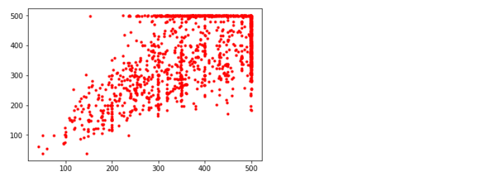

LeNet-5, AlexNet, GoogLeNet
  

# CNN 기초 분류기 구조 구현하기

이 프로젝트는 LeNet-5, AlexNet, GoogLeNet을 직접 구현하는 프로젝트입니다.  

구현해보는 것의 목적은 초심자 입장에서 클래식한 CNN 구조들 더 잘 이해하기 위해서 입니다.

1. 데이터 셋은 LeNet-5는 MNIST, AlexNet과 GoogLeNet은 Kaggle의 Dogs vs. Cats을 사용하겠습니다.
2. 성능 평가 방법은 정확도를 사용하겠습니다.
3. 러닝 모델은 LeNet-5, AlexNet, GoogLeNet을 사용하겠습니다.
4. 러닝 알고리즘은 Adam을 쓰도록 하겠습니다.

기본 설정
~~~
import numpy as np
import os
import matplotlib
import matplotlib.pyplot as plt
import pandas as pd
import scipy.misc
import tensorflow as tf
import matplotlib.image as mpimg
from sklearn.model_selection import train_test_split

def reset_graph(seed=42):
    tf.reset_default_graph()
    tf.set_random_seed(seed)
    np.random.seed(seed)

matplotlib.rc('font', family='NanumBarunGothic')
plt.rcParams['axes.unicode_minus'] = False
~~~

## 1. LeNet-5

LeNet-5은 MNIST 숫자 이미지 데이터를 이용하겠습니다. LeNet-5 구조는 가장 널리 알려진 CNN 구조로서 손글씨 숫자 인식에 널리 사용되었습니다.

### LeNet-5의 기본 구조 확인하기

층| 종류| 특성 맵| 크기| 커널 크기| 스트라이드| 활성화 함수
----|----|----|-----|-----|-----|-----
출력|완전 연결|-|10|-|-|RBF
F6|완전 연결|-|84| -| -|tanh
C5|합성곱| 120| 1$\times$ 1| 5$\times $5| 1|tanh
S4| 평균 풀링|16|5$\times $5| 2$\times $2| 2| tanh
C3|합성곱| 16 | 10$ \times $10 | 5$\times $5| 1|tanh
S2| 평균 풀링|6|14$\times $14| 2$\times $2| 2| tanh
C1 | 합성곱| 6 | 28$ \times $28| 5$\times $5| 1|tanh
입력| 입력| 1| 32$ \times $32| -| - | -

- MNIST 이미지는 28 $\times$ 28 픽셀이지만 제로 패딩되어 32 $\times$ 32가 되고 네트워크에 주입되기 전에 정규화됩니다. 네트워크의 나머지 부분은 패딩을 사용하지 않습니다.
- 평균 풀링층의 각 뉴런은 입력의 평균을 계산한 다음, 그 값에 학습되는 계숫값을 곱하고 학습되는 값인 편향을 더합니다. 그리고 활성화 함수를 적용합니다.
- C3에 있는 대부분의 뉴런은 S2의 3개 또는 4개 맵에 있는 뉴런에만 연결됩니다(이 부분은 나중에 더 정확하게 구현하겠습니다).

MNIST 데이터를 불러와 보겠습니다.
~~~
reset_graph()

from tensorflow.examples.tutorials.mnist import input_data

mnist = input_data.read_data_sets("MNIST_data", one_hot=True)

x = tf.placeholder("float", shape=[None, 784])
y_ = tf.placeholder("float", shape=[None, 10])

x_image = tf.reshape(x, [-1, 28, 28, 1])
~~~

### LeNet-5 구조 만들기

가중치를 표준편차 0.1을 갖는 난수로 초기화하는 함수와 바이어스를 0.1로 초기화하는 함수를 정의합니다.

~~~
def weight_variable(shape):
    initial = tf.truncated_normal(shape, stddev=0.1)
    return tf.Variable(initial)

def bias_variable(shape):
    initial = tf.constant(0.1, shape=shape)
    return tf.Variable(initial)
~~~

stride는 1로 하고 패딩은 0으로 하는 합성곱층을 만드는 함수와 2 $\times$ 2 평균 풀링 레이어를 위한 함수를 정의합니다.

~~~
def conv2d(x, W, padding="VALID"):
    return tf.nn.conv2d(x, W, strides=[1,1,1,1], padding=padding)

def avg_pool_2x2(x):
    return tf.nn.avg_pool(x, ksize=[1,2,2,1], strides=[1,2,2,1], padding="VALID")
~~~

첫 번째 합성곱층을 만들기 위해 가중치와 바이어스 텐서를 만들고, 활성화함수는 tanh 함수를 사용합니다. 그리고 합성곱층 뒤에 평균 풀링층을 추가합니다.

~~~
W_conv1 = weight_variable([5,5,1,6])
  ## 수용장 너비, 수용장 높이, 컬러, 특성 맵 개수
b_conv1 = bias_variable([6])

h_conv1 = tf.nn.tanh(conv2d(x_image, W_conv1,padding="SAME") + b_conv1)
h_pool1 = avg_pool_2x2(h_conv1)
~~~

두 번째 합성곱층을 만들기 위해 가중치와 바이어스 텐서를 만들고, 활성화함수는 tanh 함수를 사용합니다. 그리고 합성곱층 뒤에 평균 풀링층을 추가합니다.
~~~
W_conv2 = weight_variable([5,5,6,16]) ## 수용장 너비, 수용장 높이, 컬러, 특성 맵 개수
b_conv2 = bias_variable([16])

h_conv2 = tf.nn.tanh(conv2d(h_pool1, W_conv2) + b_conv2)
h_pool2 = avg_pool_2x2(h_conv2)
~~~

세 번째 합성곱층을 만들기 위해 가중치와 바이어스 텐서를 만듭니다.
~~~
W_conv3 = weight_variable([5,5,16,120]) ## 수용장 너비, 수용장 높이, 컬러, 특성 맵 개수
b_conv3 = bias_variable([120])

h_conv3 = tf.nn.tanh(conv2d(h_pool2, W_conv3) + b_conv3)
h_conv3.get_shape()
~~~
~~~
  ## 결과
TensorShape([Dimension(None), Dimension(1), Dimension(1), Dimension(120)])
~~~

RBF 층에 연결하기 위해 완전연결 층을 추가합니다. 이전 합성곱층의 결과를 1차원 텐서로 변환하여 tanh 활성화함수에 전달합니다.
~~~
W_fc1 = weight_variable([1 * 1 * 120, 84]) ## 84는 뉴런 개수
b_fc1 = bias_variable([84])

h_conv3_flat = tf.reshape(h_conv3, [-1, 1 * 1 * 120])
h_fc1 = tf.nn.tanh(tf.matmul(h_conv3_flat, W_fc1) + b_fc1)
~~~

마지막으로 RBF 층 레이어를 추가해야 하지만, 정확한 RBF 함수의 하이퍼파라미터를 구체적으로 설정하기 어려워 Linear 활성화 함수를 사용하겠습니다.
~~~
W_fc2 = weight_variable([84, 10])
b_fc2 = bias_variable([10])

logits = tf.matmul(h_fc1, W_fc2) + b_fc2
~~~

이제 비용함수를 정의하고 최적화알고리즘, 평가를 위한 연산을 정의하겠습니다.
~~~
cross_entropy = tf.nn.softmax_cross_entropy_with_logits_v2(labels=y_, logits=logits)
loss_operation = tf.reduce_mean(cross_entropy)

optimizer = tf.train.AdamOptimizer(learning_rate=0.001)
train_step = optimizer.minimize(loss_operation)

correct_prediction = tf.equal(tf.argmax(logits, 1), tf.argmax(y_, 1))
accuracy = tf.reduce_mean(tf.cast(correct_prediction, "float"))
~~~

이제 훈련시켜보겠습니다.
~~~
init = tf.global_variables_initializer()
saver = tf.train.Saver()

with tf.Session() as sess:
    init.run()
    for i in range(20000):
        batch = mnist.train.next_batch(50)
        if i % 1000 == 0:
            train_accuracy = sess.run(accuracy, feed_dict={
                x:batch[0], y_: batch[1]
            })
            print("step %d, training accuracy %g" %(i, train_accuracy))
        sess.run(train_step, feed_dict={x: batch[0], y_: batch[1]})

    ## 최종결과
    print("test accuracy %g" % sess.run(
            accuracy, feed_dict={x: mnist.test.images, y_: mnist.test.labels}))

    save_path = saver.save(sess, "./cnn_lenet.ckpt")
~~~

매우 정확하게 맞추는 모습을 볼수 있습니다.

## 2. AlexNet

AlexNet은 개와 고양이 이미지 데이터를 이용하겠습니다. AlexNet 구조는 2012년 이미지넷 대회에서 큰 차이로 우승했습니다. 이 구조는 더 크고 깊을 뿐 LeNet-5와 매우 비슷하며, 처음으로 합성곱층 위에 풀링층을 쌓지 않고 바로 합성곱층끼리 쌓았습니다. 원래는 주어진 이미지를 랜덤하게 여러 간격으로 이동하거나 수평으로 뒤집고 조명을 바꾸는 식으로 데이터 증식을 수행했습니다. 하지만 이 프로젝트에서는 구현하지 않았습니다.

### AlexNet의 기본 구조 확인하기

층| 종류| 특성 맵| 크기| 커널 크기| 스트라이드|패딩| 활성화 함수
----|----|----|-----|-----|-----|-----|--
출력|완전 연결|-|1000|-|-|-|Softmax
F9|완전 연결|-|4096| -|-|-|ReLu
F8|완전 연결|-|4096| -|-|-|ReLu
C7|합성곱| 256| 13$\times$ 13| 3$\times $3| 1|SAME|ReLU
C6|합성곱| 384| 13$\times$ 13| 3$\times $3| 1|SAME|ReLU
C5|합성곱| 384| 13$\times$ 13| 3$\times $3| 1|SAME|ReLU
S4| 최대 풀링|256|13$\times$ 13| 3$\times $3| 2| VALID|-
C3|합성곱| 256| 27$ \times $27 | 5$\times $5| 1|SAME|ReLU
S2| 최대 풀링|96|27$\times $27| 3$\times $3| 2| VALID|-
C1 | 합성곱| 96 | 55$ \times $55| 11$\times $11| 4|SAME|ReLU
입력| 입력| 3(RGB)| 224$ \times $224| -| - | -|-

과대적합을 줄이기 위해 드롭아웃 규제 기법을 사용했습니다.
- 훈련하는 동안 F8과 F9의 출력에 드롭아웃(50% 드랍아웃 비율)을 적용했습니다.

AlexNet은 C1과 C3 층의 ReLU 단계 후에 바로 LRN(local response normalization)이라 부르는 정규화 단계를 사용했습니다. 이 정규화는 가장 강하게 활성화된 뉴런이 다른 특성 맵에 있는 같은 위치의 뉴런을 억제하는 형태입니다(생물학적 뉴런에서 관측된 모습입니다).

AlexNet에서 LRN 하이퍼파라미터는 $r = 2$, $\alpha = 0.00002$, $\beta = 0.75$, $k = 1$로 설정되었습니다. 이 단계는 텐서플로의 tf.nn.local_response_normalization( ) 연산을 사용하여 구현할 수 있습니다.

### Kaggle Dogs vs. Cats 데이터 전처리

Dogs vs. Cats 데이터의 경우, 주어진 데이터가 이미지 데이터이기 때문에 전처리가 조금 필요합니다.
~~~
TRAIN_DIR = 'datasets/cat_dog/train'

train_image_file_names = [TRAIN_DIR + '/' + i for i in os.listdir(TRAIN_DIR)][10000:15000]
~~~

제 컴퓨터의 경우 많은 이미지를 처리하기엔 사양이 부족하므로, train 데이터에서는 2000개의 데이터만 가져오겠습니다.

주어진 데이터를 확인해보겠습니다.
~~~
import matplotlib.image as mpimg

data = [mpimg.imread(i) for i in train_image_file_names]

width = []
height = []
for image in data:
    h, w, d = np.shape(image)
    width.append(w)
    height.append(h)

plt.plot(width, height, '.r')
plt.show()
~~~

~~~
print("number of images which have width over 500:", np.sum(np.array(width) > 500))
print("number of images which have width over 500:", np.sum(np.array(height) > 500))
~~~
~~~
  ## 결과
number of images which have width over 500: 0
number of images which have width over 500: 0
~~~

전체 데이터 기준으로, 높이와 너비가 500을 넘는 객체는 2개가 있습니다. 2 객체를 지우고, 나머지 이미지의 사이즈를 (500,500)으로 만들겠습니다.
~~~
for i in range(2):
    tmp = np.argmax(np.array(width))
    if width[tmp] > 500:
        data.pop(tmp)
        width.pop(tmp)
        height.pop(tmp)
        train_image_file_names.pop(tmp)
~~~

이제 데이터 전처리가 거의 끝났습니다. 이제 이 데이터들을 numpy 배열로 만들고, 사이즈를 줄이겠습니다.

~~~
def create_data(image_file_names, width=500, height=500, final_width=214,
      final_height=214):
    names = tuple(image_file_names)
    l = len(names)
    data = np.zeros((l, final_width, final_height, 3))

    def resize_width_height(image, width=width, height=width,
            final_width=final_width, final_height=final_height):
        tmp = np.zeros((width,height,3))
        tmp[:image.shape[0], :image.shape[1], :] = image
        tmp = scipy.misc.imresize(tmp, (final_width,final_height))
        tmp = tmp/ 255
        return tmp.reshape(-1, final_width, final_height, 3)
        ## batch, width, height, channel

    for i in range(l):
        tmp = mpimg.imread(names[i])
        data[i] = resize_width_height(tmp)
        if i % 10 == 0:
            print("아직 문제 없습니다.", i, end='\r')
    return data
~~~
~~~
train_data = create_data(train_image_file_names)
  ## train_image_file은 이미지 주소가 있는 str입니다.
~~~
~~~
labels = np.array([[1., 0.] if 'dog' in name[23:]
        else [0., 1.] for name in train_image_file_names])
~~~
~~~
train, test, train_labels, test_labels = train_test_split(train_data, lables,
      0.2, random_state=42)
~~~
완료되었습니다. 이제 이 데이터를 가지고 AlexNet을 훈련시켜보겠습니다.

~~~
del train_data
del labels
del data
del height
del width
del train_image_file_names
~~~

### AlexNet 구조 구성하기

~~~
reset_graph()

X_image = tf.placeholder("float", shape=[None, 214, 214, 3])
y = tf.placeholder("float", shape=[None, 2])
~~~

가중치를 표준편차 0.1을 갖는 난수로 초기화하는 함수와 바이어스를 0.1로 초기화하는 함수를 정의합니다.
~~~
def weight_variable(shape):
    initial = tf.truncated_normal(shape, stddev=0.1)
    return tf.Variable(initial)

def bias_variable(shape):
    initial = tf.constant(0.1, shape=shape)
    return tf.Variable(initial)
~~~

stride는 1로 하고 패딩은 0으로 하는 합성곱층을 만드는 함수와 2 $\times$ 2 최대 풀링 레이어를 위한 함수를 정의합니다.
~~~
def conv2d(x, W, strides=[1,1,1,1], padding="SAME"):
    return tf.nn.conv2d(x, W, strides=strides, padding=padding)

def max_pool_3x3(x):
    return tf.nn.max_pool(x, ksize=[1,3,3,1], strides=[1,2,2,1], padding="VALID")
~~~

첫 번째 합성곱층을 만들기 위해 가중치와 바이어스 텐서를 만들고, 활성화함수는 ReLU 함수를 사용합니다. 그리고 합성곱층 뒤에 최대 풀링층을 추가합니다.
~~~
W_conv1 = weight_variable([11,11,3,96]) ## 수용장 너비, 수용장 높이, 컬러, 특성 맵 개수
b_conv1 = bias_variable([96])

h_conv1 = tf.nn.relu(conv2d(X_image, W_conv1, [1,4,4,1]) + b_conv1)

lrn_conv1 = tf.nn.lrn(h_conv1, depth_radius=2, bias=1,
                          alpha=0.00002, beta=0.75)

h_pool1 = max_pool_3x3(lrn_conv1)
~~~

두 번째 합성곱층을 만들기 위해 가중치와 바이어스 텐서를 만들고, 활성화함수는 ReLU 함수를 사용합니다. 그리고 합성곱층 뒤에 최대 풀링층을 추가합니다.
~~~
W_conv2 = weight_variable([5,5,96,256]) ## 수용장 너비, 수용장 높이, 컬러, 특성 맵 개수
b_conv2 = bias_variable([256])

h_conv2 = tf.nn.relu(conv2d(h_pool1, W_conv2) + b_conv2)

lrn_conv2 = tf.nn.lrn(h_conv2, depth_radius=2, bias=1,
                          alpha=0.00002, beta=0.75)

h_pool2 = max_pool_3x3(lrn_conv2)
~~~

세 번째 합성곱층부터 다섯 번째 합성곱층을 쌓아보겠습니다. 활성화함수는 ReLU 함수를 사용합니다.
~~~
  ## 세 번째
W_conv3 = weight_variable([3,3,256,384]) ## 수용장 너비, 수용장 높이, 컬러, 특성 맵 개수
b_conv3 = bias_variable([384])

h_conv3 = tf.nn.relu(conv2d(h_pool2, W_conv3) + b_conv3)

  ## 네 번째
W_conv4 = weight_variable([3,3,384,384]) ## 수용장 너비, 수용장 높이, 컬러, 특성 맵 개수
b_conv4 = bias_variable([384])

h_conv4 = tf.nn.relu(conv2d(h_conv3, W_conv4) + b_conv4)

  ## 다섯 번째
W_conv5 = weight_variable([3,3,384,256]) ## 수용장 너비, 수용장 높이, 컬러, 특성 맵 개수
b_conv5 = bias_variable([256])

h_conv5 = tf.nn.relu(conv2d(h_conv4, W_conv5) + b_conv5)
h_conv5.get_shape()
~~~
~~~
  ## 결과
TensorShape([Dimension(None), Dimension(12), Dimension(12), Dimension(256)])
~~~

ReLU 완전 연결 층을 두 번 추가합니다.
~~~
W_fc1 = weight_variable([12 * 12 * 256, 4096]) ## 4096는 뉴런 개수
b_fc1 = bias_variable([4096])

h_conv5_flat = tf.reshape(h_conv5, [-1, 12 * 12 * 256])
h_fc1 = tf.nn.relu(tf.matmul(h_conv5_flat, W_fc1) + b_fc1)

keep_prob = tf.placeholder("float")
h_fc1_drop = tf.nn.dropout(h_fc1, keep_prob)

h_fc1_drop.get_shape()
~~~
~~~
  ## 결과
TensorShape([Dimension(None), Dimension(4096)])
~~~

~~~
W_fc2 = weight_variable([4096, 4096]) ## 4096는 뉴런 개수
b_fc2 = bias_variable([4096])

h_fc2 = tf.nn.relu(tf.matmul(h_fc1, W_fc2) + b_fc2)

h_fc2_drop = tf.nn.dropout(h_fc2, keep_prob)

h_fc2_drop.get_shape()
~~~
~~~
  ## 결과
TensorShape([Dimension(None), Dimension(4096)])
~~~

Softmax 활성화 함수를 가지고 있는 출력층을 만들겠습니다.
~~~
W_fc3 = weight_variable([4096, 2])
b_fc3 = bias_variable([2])

k = tf.matmul(h_fc2_drop, W_fc3) + b_fc3
y_conv = tf.nn.softmax(k)
~~~
##### 제가 쓰는 GPU에서는 OOM 에러가 문제가 되어, 뉴런 개수를 줄여야 했습니다.

~~~
W_fc1 = weight_variable([12 * 12 * 256, 300]) ## 300은 뉴런 개수
b_fc1 = bias_variable([300])

h_conv5_flat = tf.reshape(h_conv5, [-1, 12 * 12 * 256])
h_fc1 = tf.nn.relu(tf.matmul(h_conv5_flat, W_fc1) + b_fc1)

keep_prob = tf.placeholder("float")
h_fc1_drop = tf.nn.dropout(h_fc1, keep_prob)

W_fc2 = weight_variable([200, 200]) ## 200은 뉴런 개수
b_fc2 = bias_variable([200])

h_fc2 = tf.nn.relu(tf.matmul(h_fc1, W_fc2) + b_fc2)

h_fc2_drop = tf.nn.dropout(h_fc2, keep_prob)

W_fc3 = weight_variable([200, 2])
b_fc3 = bias_variable([2])

k = tf.matmul(h_fc2_drop, W_fc3) + b_fc3
y_conv = tf.nn.softmax(k)
~~~

#### 다시 돌아와서...

손실함수는 cross entropy로 하겠습니다.
~~~
xentropy = tf.nn.softmax_cross_entropy_with_logits(
        labels=y, logits=k)
loss = tf.reduce_mean(xentropy, name="loss")
~~~

러닝 알고리즘을 정의하겠습니다.
~~~
optimizer = tf.train.AdamOptimizer(learning_rate=0.001)
train_step = optimizer.minimize(loss)
~~~

이제 정확도 함수를 정의하겠습니다.
~~~
correct_prediction = tf.equal(tf.argmax(y_conv, 1), tf.argmax(y, 1))
accuracy = tf.reduce_mean(tf.cast(correct_prediction, "float"))
~~~

이제 신경망을 훈련시켜보겠습니다.
~~~
def shuffle_batch(X, y, batch_size):
    rnd_idx = np.random.permutation(len(X))
    n_batches = len(X) // batch_size
    for batch_idx in np.array_split(rnd_idx, n_batches):
        X_batch, y_batch = X[batch_idx], y[batch_idx]
        yield X_batch, y_batch
~~~
~~~
init = tf.global_variables_initializer()
saver = tf.train.Saver()

n_epochs = 300
batch_size = 256

with tf.Session() as sess:
    init.run()

    for epoch in range(n_epochs):
        num = 0
        for X_batch, y_batch in shuffle_batch(train, train_labels, batch_size):
            sess.run(train_step, feed_dict={X_image: X_batch, y: y_batch, keep_prob: 0.5})
        if epoch % 10 == 0:
            acc_batch = accuracy.eval(feed_dict={X_image: train,
                  y: train_labels, keep_prob: 0.5})
            print('epoch', epoch, "인 데이터 정확도:", acc_batch)        

    save_path = saver.save(sess, "./cnn_alexnet.ckpt")
~~~
~~~
  ## 결과
  epoch 0 인 데이터 정확도: 0.518797
  epoch 10 인 데이터 정확도: 0.5300752
  epoch 20 인 데이터 정확도: 0.49624062
  epoch 30 인 데이터 정확도: 0.5714286
  epoch 40 인 데이터 정확도: 0.56766915
  epoch 50 인 데이터 정확도: 0.5488722
  epoch 60 인 데이터 정확도: 0.50751877
  epoch 70 인 데이터 정확도: 0.5488722
  epoch 80 인 데이터 정확도: 0.5112782
  epoch 90 인 데이터 정확도: 0.5150376
  epoch 100 인 데이터 정확도: 0.5
  epoch 110 인 데이터 정확도: 0.5263158
  epoch 120 인 데이터 정확도: 0.5263158
  epoch 130 인 데이터 정확도: 0.5488722
  epoch 140 인 데이터 정확도: 0.575188
  epoch 150 인 데이터 정확도: 0.5488722
  epoch 160 인 데이터 정확도: 0.56390977
  epoch 170 인 데이터 정확도: 0.5601504
  epoch 180 인 데이터 정확도: 0.53759396
  epoch 190 인 데이터 정확도: 0.5263158
  epoch 200 인 데이터 정확도: 0.50751877
  epoch 210 인 데이터 정확도: 0.5601504
  epoch 220 인 데이터 정확도: 0.5150376
  epoch 230 인 데이터 정확도: 0.5150376
  epoch 240 인 데이터 정확도: 0.52255636
  epoch 250 인 데이터 정확도: 0.53759396
  epoch 260 인 데이터 정확도: 0.56766915
  epoch 270 인 데이터 정확도: 0.5112782
  epoch 280 인 데이터 정확도: 0.5451128
  epoch 290 인 데이터 정확도: 0.518797
~~~
~~~
with tf.Session() as sess:
    saver.restore(sess, './cnn_alexnet.ckpt')
    print('test accuracy %g' % sess.run(accuracy,feed_dict={X_image: test,
        y:test_labels, keep_prob: 1.}))
~~~
~~~
  ## 결과
test accuracy 0.51
~~~

결과가 좋게 나오지는 않습니다. 아마 드랍아웃 층이 2개 있기 때문에 각 가중치들이 적절하게 훈련되지 못한 것 같습니다. 혹은 데이터가 2000 * 0.8개 밖에 없어서 훈련이 잘되지 못했을 수도 있습니다.

## 3. GoogLeNet

GoogLeNet의 가장 큰 특징은 인셉션 모듈이라는 서브 네트워크를 가지고 있다는 것입니다. GoogLeNet은 이전 구조들보다 훨씬 효과적으로 파라미터를 사용합니다. 실제로 GoogLeNet은 AlexNet보다 10배나 적은 파라미터를 가집니다.

### GoogLeNet의 기본 구조 확인하기  

인셉션 모듈의 구조는 다음과 같습니다.

여기서 3$\times$3 + 1(S)는 3$\times $3 커널, 스트라이드 1, SAME 패딩을 사용한다는 뜻입니다. 처음 신호가 복사되어 네 개의 다른 층에 주입됩니다. 모든 합성곱층은 ReLU 활성화 함수를 사용합니다. 두 번째 합성곱층은 각기 다른 커널 크기(1 $\times$ 1, 3$\times$ 3, 5$\times$ 5)를 사용하여 다른 크기의 패턴을 잡습니다. 모든 층은 스트라이드 1과 SAME 패딩을 사용하므로 출력의 높이와 너비가 모두 입력과 같습니다. 이 다음 출력을 깊이 연결 층(Depth Concat Layer)에서 특성 맵 쌓듯이 쌓을 수 있습니다. 이 연결 층은 텐서플로의 axis=3 매개변수로 tf.concat( ) 연산을 사용하여 구현할 수 있습니다.  

인셉션 모듈에서 1 $\times$ 1 커널의 합성곱층은 두 개의 목적을 가지고 있습니다.
- 입력의 채널보다 더 적은 특성 맵을 출력합니다. 차원을 줄이는 효과를 볼 수 있습니다.
- 합성곱층의 쌍([1 $\times$ 1, 3 $\times$ 3]과 [1 $\times$ 1, 5 $\times$ 5])이 복잡한 패턴을 감지할 수 있는 한 개의 합성곱층처럼 작동합니다.

Note.  
각 합석곱층의 합성곱 커널의 수는 하이퍼파라미터입니다. 인셉션 모듈을 추가하면 6개의 하이퍼파라미터를 조율해야 합니다.  

이제 GoogLeNet CNN의 구조를 살펴보겠습니다.

- 합성곱층과 풀링층에서 출력되는 특성 맵의 수는 앞에 있는 숫자입니다.
- 인셉션 모듈에 있는 숫자는 합성곱층에서 출력하는 특성 맵의 수입니다.
- 합성곱층은 ReLU 활성화 함수를 사용합니다.

이제 이 네트워크를 살펴보겠습니다.
- 처음 두 층은 계산의 양을 줄이기 위해 만든 층입니다.
- LRN 층은 여기서도 쓰입니다(다양한 특성을 학습하도록 합니다).
- 이어지는 두 개의 합성곱층은 병목층처럼 작용합니다(차원을 줄인다는 이야기입니다).
- 다시 한번 LRN 층을 씁니다.
- 그다음 최대 풀링층이 이미지의 높이와 너비를 줄입니다.
- 9개의 인셉션 모듈이 이어지고, 차원 감소와 속 도 향상을 위해 최대 풀링층을 몇개 넣어 놓습니다.
- 그 다음에 평균 폴링층이 특성 맴 크기의 커널을 VALID 패딩으로 적용해 1 $\times$ 1 특성 맵을 출력합니다. 이런 전략을 전역 평균 폴링이라고 합니다. 이 층은 CNN 위에 여러 개의 완전 연결 층을 놓는 것을 불필요하게 만듦으로 네트워크의 파라미터 수를 많이 줄여주고 과대적합의 위험을 줄여줍니다.
- 규제를 위한 드롭아웃과 클래스 확률 추정 값을 출력하기 위한 소프트맥스 활성화 함수를 적용한 완전 연결 층입니다.

### GoogLeNet 구조 구성하기

~~~
reset_graph()

X_image = tf.placeholder("float", shape=[None, 214, 214, 3])
y = tf.placeholder("float", shape=[None, 2])
~~~

가중치를 표준편차 0.1을 갖는 난수로 초기화하는 함수와 바이어스를 0.1로 초기화하는 함수를 정의합니다.

~~~
def weight_variable(shape):
    initial = tf.truncated_normal(shape, stddev=0.1)
    return tf.Variable(initial)

def bias_variable(shape):
    initial = tf.constant(0.1, shape=shape)
    return tf.Variable(initial)
~~~

stride는 1로 하고 패딩은 0으로 하는 합성곱층을 만드는 함수와 2 $\times$ 2 최대 풀링 레이어와 평균 풀링 레이어를 위한 함수를 정의합니다.
~~~
def conv2d(x, W, strides=[1,1,1,1], padding="SAME"):
    return tf.nn.conv2d(x, W, strides=strides, padding=padding)

def max_pool_3x3(x, padding="SAME"):
    return tf.nn.max_pool(x, ksize=[1,3,3,1], strides=[1,2,2,1], padding=padding)

def avg_pool_7x7(x, padding="VALID"):
    return tf.nn.avg_pool(x, ksize=[1,7,7,1], strides=[1,1,1,1], padding=padding)
~~~

첫 번째 합성곱층을 만들기 위해 가중치와 바이어스 텐서를 만들고, 활성화함수는 ReLU 함수를 사용합니다. 그리고 합성곱층 뒤에 최대 풀링층을 추가합니다.
~~~
W_conv1 = weight_variable([7,7,3,64]) ## 수용장 너비, 수용장 높이, 컬러, 특성 맵 개수
b_conv1 = bias_variable([64])

h_conv1 = tf.nn.relu(conv2d(X_image, W_conv1, strides=[1,2,2,1]) + b_conv1)

h_pool1 = max_pool_3x3(h_conv1)

lrn_conv1 = tf.nn.lrn(h_pool1, depth_radius=2, bias=1,
                          alpha=0.00002, beta=0.75)
~~~

두 번째 합성곱층과 세 번째 합성곱층을 만들기 위해 가중치와 바이어스 텐서를 만들고, 활성화함수는 ReLU 함수를 사용합니다. 그리고 합성곱층 뒤에 정규화 함수를 추가한 후 최대 풀링층을 추가합니다.
~~~
b_conv2 = bias_variable([64])

h_conv2 = tf.nn.relu(conv2d(lrn_conv1, W_conv2, strides=[1,1,1,1]) + b_conv2)

W_conv3 = weight_variable([3,3,64,192]) ## 수용장 너비, 수용장 높이, 컬러, 특성 맵 개수
b_conv3 = bias_variable([192])

h_conv3 = tf.nn.relu(conv2d(h_conv2, W_conv3, strides=[1,1,1,1]) + b_conv3)

lrn_conv2 = tf.nn.lrn(h_conv3, depth_radius=2, bias=1,
                          alpha=0.00002, beta=0.75)

h_pool2 = max_pool_3x3(lrn_conv2)
~~~

이제 인셉션 모듈을 만들어보겠습니다. 인셉션 모듈을 편하게 사용하기위해 함수로 만들겠습니다.
~~~
def inception(x, in_channels, filter_count):
    # 1x1 1
    W_incep1  = weight_variable([1,1,in_channels, filter_count[0]])
    b_incep1 = bias_variable([filter_count[0]])
    one_by_one1 = tf.nn.relu(conv2d(x, W_incep1, strides=[1,1,1,1]) + b_incep1)

    # 1x1 2, 3x3
    W_incep2  = weight_variable([1,1,in_channels, filter_count[1]])
    b_incep2 = bias_variable([filter_count[1]])
    one_by_one2 = tf.nn.relu(conv2d(x, W_incep2, strides=[1,1,1,1]) + b_incep2)

    W_incep3x3  = weight_variable([3,3,filter_count[1], filter_count[2]])
    b_incep3x3 = bias_variable([filter_count[2]])
    three_by_three = tf.nn.relu(conv2d(one_by_one2,
            W_incep3x3, strides=[1,1,1,1]) + b_incep3x3)

    # 1x1 3, 5x5
    W_incep3  = weight_variable([1,1,in_channels, filter_count[3]])
    b_incep3 = bias_variable([filter_count[3]])
    one_by_one3 = tf.nn.relu(conv2d(x, W_incep3, strides=[1,1,1,1]) + b_incep3)

    W_incep5x5  = weight_variable([5,5,filter_count[3], filter_count[4]])
    b_incep5x5 = bias_variable([filter_count[4]])
    five_by_five = tf.nn.relu(conv2d(one_by_one3,
            W_incep5x5, strides=[1,1,1,1]) + b_incep5x5)

    # max pool, 1x1 4
    max_pool = tf.nn.max_pool(x, ksize=[1,3,3,1], strides=[1,1,1,1], padding='SAME')

    W_incep4  = weight_variable([1,1,in_channels, filter_count[5]])
    b_incep4 = bias_variable([filter_count[5]])
    one_by_one4 = tf.nn.relu(conv2d(max_pool, W_incep4, strides=[1,1,1,1]) + b_incep4)

    ## concat
    x = tf.concat([one_by_one1, three_by_three, five_by_five, one_by_one4], axis=3)

    return tf.nn.relu(x)
~~~

1,2 번째 인셉션 모듈을 만들겠습니다. 그리고 최대 풀링층을 추가합니다.
~~~
h_incep1 = inception(h_pool2, in_channels=192, filter_count=[64,96,128,16,32,32])
h_incep2 = inception(h_incep1, in_channels=64+128+32+32,
    filter_count=[128,128,192,32,96,64])

h_pool3 = max_pool_3x3(h_incep2)
h_pool3.get_shape()
~~~
~~~
  ## 결과
TensorShape([Dimension(None), Dimension(14), Dimension(14), Dimension(480)])
~~~

3,4,5,6,7 번째 인셉션 모듈을 추가하겠습니다. 그리고 최대 풀링층을 추가합니다.
~~~
h_incep3 = inception(h_pool3, in_channels=480,
      filter_count=[192,96,208,16,48,64])
h_incep4 = inception(h_incep3, in_channels=192+208+48+64,
    filter_count=[160,112,224,24,64,64])
h_incep5 = inception(h_incep4, in_channels=160+224+64+64,
    filter_count=[128,128,256,24,64,64])
h_incep6 = inception(h_incep5, in_channels=128+256+64+64,   
    filter_count=[112,144,288,32,64,64])
h_incep7 = inception(h_incep6, in_channels=112+288+64+64,
    filter_count=[256,160,320,32,128,128])

h_pool4 = max_pool_3x3(h_incep7)
h_pool4.get_shape()
~~~
~~~
  ## 결과
TensorShape([Dimension(None), Dimension(7), Dimension(7), Dimension(832)])
~~~

8, 9 번째 인셉션 모듈을 추가하겠습니다. 그리고 평균 풀링층을 추가합니다.
~~~
h_incep8 = inception(h_pool4, in_channels=832, filter_count=[256,160,320,32,128,128])
h_incep9 = inception(h_incep8, in_channels=256+320+128+128,
    filter_count=[384,192,384,48,128,128])

h_pool5 = avg_pool_7x7(h_incep9)
h_pool5.get_shape()
~~~
~~~
  ## 결과
TensorShape([Dimension(None), Dimension(1), Dimension(1), Dimension(1024)])
~~~

드랍아웃 층을 추가하겠습니다.
~~~
keep_prob = tf.placeholder("float")
h_fc1_drop = tf.nn.dropout(h_pool5, keep_prob)
~~~

완전 연결층을 추가합니다.
~~~
W_fc1 = weight_variable([1 * 1 * 1024, 1000])
b_fc1 = bias_variable([1000])

h_fc1_drop_flat = tf.reshape(h_fc1_drop, [-1, 1 * 1 * 1024])
h_fc1 = tf.nn.relu(tf.matmul(h_fc1_drop_flat, W_fc1) + b_fc1)
~~~

softmax층과 연결합니다.
~~~
W_fc2 = weight_variable([1000, 2])
b_fc2 = bias_variable([2])

k = tf.matmul(h_fc1, W_fc2) + b_fc2
y_conv = tf.nn.softmax(k)
~~~

손실함수는 cross entropy로 하겠습니다.
~~~
xentropy = tf.nn.softmax_cross_entropy_with_logits(
        labels=y, logits=k)
loss = tf.reduce_mean(xentropy, name="loss")
~~~

러닝 알고리즘을 정의하겠습니다.
~~~
optimizer = tf.train.AdamOptimizer(learning_rate=0.001)
train_step = optimizer.minimize(loss)
~~~

이제 정확도 함수를 정의하겠습니다.
~~~
correct_prediction = tf.equal(tf.argmax(y_conv, 1), tf.argmax(y, 1))
accuracy = tf.reduce_mean(tf.cast(correct_prediction, "float"))
~~~

이제 신경망을 훈련시켜보겠습니다.
~~~
def shuffle_batch(X, y, batch_size):
    rnd_idx = np.random.permutation(len(X))
    n_batches = len(X) // batch_size
    for batch_idx in np.array_split(rnd_idx, n_batches):
        X_batch, y_batch = X[batch_idx], y[batch_idx]
        yield X_batch, y_batch
~~~

~~~
init = tf.global_variables_initializer()
saver = tf.train.Saver()

n_epochs = 300
batch_size = 256

with tf.Session() as sess:
    init.run()

    for epoch in range(n_epochs):
        for X_batch, y_batch in shuffle_batch(train_data, labels, batch_size):
            sess.run(train_step, feed_dict={X_image: X_batch, y: y_batch, keep_prob: 0.4})
        if epoch % 10 == 0:
            acc_batch = accuracy.eval(feed_dict={X_image: train,
                y: train_labels, keep_prob: 0.4})
            print(num, "인 데이터 정확도:", acc_batch)
    save_path = saver.save(sess, "./cnn_googlenet.ckpt")
~~~
~~~
  ## 결과
  epoch 0 인 데이터 정확도: 0.518797
  epoch 10 인 데이터 정확도: 0.5150376
  epoch 20 인 데이터 정확도: 0.52255636
  epoch 30 인 데이터 정확도: 0.52255636
  epoch 40 인 데이터 정확도: 0.575188
  epoch 50 인 데이터 정확도: 0.575188
  epoch 60 인 데이터 정확도: 0.8120301
  epoch 70 인 데이터 정확도: 0.83082706
  epoch 80 인 데이터 정확도: 0.90225565
  epoch 90 인 데이터 정확도: 0.9398496
  epoch 100 인 데이터 정확도: 0.65037596
  epoch 110 인 데이터 정확도: 0.7443609
  epoch 120 인 데이터 정확도: 0.9511278
  epoch 130 인 데이터 정확도: 0.55263156
  epoch 140 인 데이터 정확도: 0.9736842
  epoch 150 인 데이터 정확도: 1.0
  epoch 160 인 데이터 정확도: 1.0
  epoch 170 인 데이터 정확도: 0.5338346
  epoch 180 인 데이터 정확도: 0.5864662
  epoch 190 인 데이터 정확도: 0.56766915
  epoch 200 인 데이터 정확도: 0.7105263
  epoch 210 인 데이터 정확도: 0.5451128
  epoch 220 인 데이터 정확도: 0.64285713
  epoch 230 인 데이터 정확도: 0.63909775
  epoch 240 인 데이터 정확도: 0.7443609
  epoch 250 인 데이터 정확도: 0.6052632
  epoch 260 인 데이터 정확도: 0.7180451
  epoch 270 인 데이터 정확도: 0.58270675
  epoch 280 인 데이터 정확도: 0.7368421
  epoch 290 인 데이터 정확도: 0.6766917
~~~
~~~
with tf.Session() as sess:
    saver.restore(sess, './cnn_googlenet.ckpt')
    print('test accuracy %g' % sess.run(accuracy,feed_dict={X_image: test,
        y:test_labels, keep_prob: 1.}))
~~~
~~~
  ## 결과
test accuracy 0.65
~~~

중간에 colab의 런타임이 끊겼었습니다. 그래도 160 에포크 정도에서는 정확도가 1까지 올라갔었습니다.

## 개선 방향

1. AlexNet과 GoogLeNet을 실행할 때 하드웨어의 한계가 많이 있었습니다. 이미지 데이터를 2000개와 배치 사이즈가 25를 넘기엔 수용하기에 RAM이 많이 힘들어했습니다.
  - 다행히도 Colaboratory를 사용해서 딥러닝을 돌릴 수는 있었지만, 큰 데이터를 돌리기에는 구글에서 제공하는 램의 크기가 충분하지 않았습니다.
2. 이미지 사이즈를 조절하는 과정을 세세하게 하지 못했습니다. 이미지의 크기를 500으로 맞추고 214로 줄이는 과정에서 214보다 작은 이미지들은 커졌다 작아져서 이미지 손실이 있었습니다.
  - 이미지 전처리를 처음 시도봤습니다. 그래서 이런 일이 일어날 것이라고 예상하지 못하고 전처리를 하였습니다. 다음에는 최종 픽셀을 기준으로 데이터셋을 분리한 후 처리해야겠습니다.
3. 텐서보드를 활용하지 못했습니다. 변수들을 캡슐화하지 못해서 텐서보드가 직관적이지 못했습니다.
  - tf.variable_scope를 사용해서 변수들을 캡슐화해야겠습니다.
4. 특성맵을 전부 다 연결하는 것이 아니라 3개 또는 4개 맵만 연결하는 것을 구현하지 못했습니다.
  - 인터넷을 더 찾아봐서 구현하는 방식을 익혀야합니다.
5. 프로젝트를 진행하는 동안 loss값에 대한 분석이 없었습니다. 분석한 결과 learning rate가 너무 높게 설정되어있었다는 것을 알게 되었습니다. learning_rate를 낮추니 성능이 월등히 상승했습니다.
  - 다음부터는 정확도만 관찰하는 것이 아니라 loss값에 대해서도 관찰해야 하겠습니다.

- AlexNet
  데이터 5000개, learning rate 0.00001로 한 결과
~~~
epoch 0 학습 데이터 정확도: 0.5413534 loss: 17800.89
epoch 10 학습 데이터 정확도: 0.5902256 loss: 5345.7676
epoch 20 학습 데이터 정확도: 0.66917294 loss: 2560.7551
epoch 30 학습 데이터 정확도: 0.7255639 loss: 2057.5256
epoch 40 학습 데이터 정확도: 0.7631579 loss: 1221.6383
epoch 50 학습 데이터 정확도: 0.7631579 loss: 1009.7392
epoch 60 학습 데이터 정확도: 0.7894737 loss: 955.5819
epoch 70 학습 데이터 정확도: 0.8233083 loss: 773.7565
epoch 80 학습 데이터 정확도: 0.81578946 loss: 595.18036
epoch 90 학습 데이터 정확도: 0.8947368 loss: 649.7446
epoch 100 학습 데이터 정확도: 0.92105263 loss: 493.70364
epoch 110 학습 데이터 정확도: 0.89097744 loss: 371.47705
epoch 120 학습 데이터 정확도: 0.9398496 loss: 330.38867
epoch 130 학습 데이터 정확도: 0.9398496 loss: 329.82562
epoch 140 학습 데이터 정확도: 0.9661654 loss: 257.31046
epoch 150 학습 데이터 정확도: 0.96240604 loss: 241.40785
epoch 160 학습 데이터 정확도: 0.9586466 loss: 191.09592
epoch 170 학습 데이터 정확도: 0.981203 loss: 176.83932
epoch 180 학습 데이터 정확도: 0.9887218 loss: 154.93065
epoch 190 학습 데이터 정확도: 0.9849624 loss: 235.75195
epoch 200 학습 데이터 정확도: 0.99248123 loss: 150.57852
epoch 210 학습 데이터 정확도: 1.0 loss: 115.70456
epoch 220 학습 데이터 정확도: 0.99248123 loss: 102.9466
epoch 230 학습 데이터 정확도: 0.9962406 loss: 107.593254
epoch 240 학습 데이터 정확도: 1.0 loss: 115.9089
epoch 250 학습 데이터 정확도: 1.0 loss: 146.89815
epoch 260 학습 데이터 정확도: 1.0 loss: 52.235523
epoch 270 학습 데이터 정확도: 1.0 loss: 94.339615
epoch 280 학습 데이터 정확도: 1.0 loss: 67.48596
epoch 290 학습 데이터 정확도: 1.0 loss: 79.43607
~~~
~~~
test accuracy 0.682
~~~

- GoogLeNet
  데이터 5000개, learning rate 0.001로 한 결과
~~~
epoch 0 학습 데이터 정확도: 0.47368422 loss: 28.671886
epoch 10 학습 데이터 정확도: 0.59398496 loss: 0.70367795
epoch 20 학습 데이터 정확도: 0.69548875 loss: 0.6604935
epoch 30 학습 데이터 정확도: 0.68421054 loss: 0.6550955
epoch 40 학습 데이터 정확도: 0.62030077 loss: 0.5573864
epoch 50 학습 데이터 정확도: 0.7406015 loss: 0.5238845
epoch 60 학습 데이터 정확도: 0.7330827 loss: 0.53350437
epoch 70 학습 데이터 정확도: 0.63909775 loss: 0.680871
epoch 80 학습 데이터 정확도: 0.68421054 loss: 0.59498054
epoch 90 학습 데이터 정확도: 0.5864662 loss: 0.63151634
epoch 100 학습 데이터 정확도: 0.60902256 loss: 0.672953
epoch 110 학습 데이터 정확도: 0.64285713 loss: 0.6467162
epoch 120 학습 데이터 정확도: 0.7631579 loss: 0.53055006
epoch 130 학습 데이터 정확도: 0.7932331 loss: 0.42774993
epoch 140 학습 데이터 정확도: 0.7706767 loss: 0.4157984
epoch 150 학습 데이터 정확도: 0.88721806 loss: 0.2904354
epoch 160 학습 데이터 정확도: 0.7330827 loss: 0.54500973
epoch 170 학습 데이터 정확도: 0.9398496 loss: 0.19880015
epoch 180 학습 데이터 정확도: 0.48120302 loss: 0.91769606
epoch 190 학습 데이터 정확도: 0.66541356 loss: 0.6070968
epoch 200 학습 데이터 정확도: 0.69548875 loss: 0.5076828
epoch 210 학습 데이터 정확도: 0.87969923 loss: 0.34613913
epoch 220 학습 데이터 정확도: 0.9511278 loss: 0.19050498
epoch 230 학습 데이터 정확도: 0.943609 loss: 0.16226535
epoch 240 학습 데이터 정확도: 0.9962406 loss: 0.013657486
epoch 250 학습 데이터 정확도: 1.0 loss: 0.002323587
epoch 260 학습 데이터 정확도: 1.0 loss: 0.0012772147
epoch 270 학습 데이터 정확도: 1.0 loss: 0.0010294323
epoch 280 학습 데이터 정확도: 1.0 loss: 0.0008198261
epoch 290 학습 데이터 정확도: 1.0 loss: 0.0006501048
~~~
~~~
test accuracy 0.758947
~~~

6. 학습이 이뤄지는 동안 검증 데이터를 나누지 않아서 적절한 에포크를 찾지 못해 과적합이 일어났습니다. 다음엔 적절한 에포크를 구할 수 있게 학습용 데이터에서 검증 데이터를 확보해야겠습니다.
